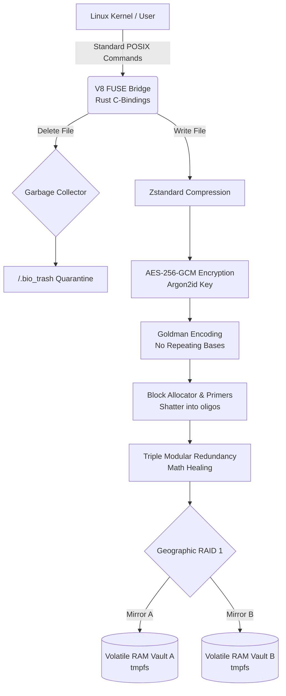

# 🏗️ Architecture & Design Document: DNA-POSIX V8 Enterprise Core
**Version:** 1.0.0 | **Date:** 2026-04-23 | **Author:** TheSNMC

---

## 1. Executive Summary
This document outlines the architecture for the **DNA-POSIX V8 Enterprise Core**, a zero-trust, stateless Virtual File System (VFS). The overarching technical goal is to natively bridge standard Linux kernel operations (POSIX) with synthetic biology, creating an anti-forensic data storage engine. The system operates entirely off-grid, utilizing volatile RAM execution while strictly adhering to mathematical data-healing and absolute data sovereignty mandates.

## 2. Architectural Drivers
**What forces shaped this architecture?**

* **Primary Goals:** * Seamless translation of digital bytes to biological chemistry (A,C,G,T) without breaking standard OS workflows.
  * Deep-tech economics: drastically reducing physical DNA synthesis costs via aggressive pre-compression.  
  * Mathematical biological healing to survive cosmic radiation or chemical degradation.
* **Technical Constraints:** * Must run entirely locally on Linux environments without Python overhead.
  * Must interface directly with the kernel via C-bindings (`libfuse`).
* **Non-Functional Requirements (NFRs):** * **Security/Privacy:** Zero persistent disk storage; 100% volatile RAM (`tmpfs`) execution to ensure physical data destruction upon power-loss.
  * **Reliability:** Aerospace-grade Write-Ahead Journaling (WAL) and geographic RAID 1 redundancy.  
  * **Performance:** Multi-threaded FUSE interceptions with a detached UI rendering at 60 FPS without blocking I/O operations.

## 3. System Architecture (The 10,000-Foot View)
The V8 Core is divided into a three-tier architecture ensuring a strict separation of concerns between OS interception, biological translation, and hardware monitoring.

* **Presentation Layer:** A detached, asynchronous TUI (Terminal User Interface) built with `ratatui`. It monitors the FUSE lifecycle, renders real-time I/O metrics, and visually suppresses master passwords during boot.
* **Domain Layer (The Codec):** Pure Rust business logic housing the context-aware Goldman Encoding state machine, the Block Allocator (primer hashing), and the Triple Modular Redundancy (TMR) voting algorithms.
* **Data/Hardware Layer:** The native Linux `libfuse` bridge and the `tmpfs` RAM arrays. It utilizes an `Arc<Mutex>` Single Source of Truth (SSOT) variable to project a spoofed 1.0 PB biological drive to the host OS.

## 4. Design Decisions & Trade-Offs (The "Why")

* **Decision 1: Zstandard (Zstd) Compression Before Encryption & Translation**
  * **Rationale:** Physical DNA synthesis is exponentially expensive per base pair.
  * **Trade-off:** Adds minor CPU overhead during write operations, but achieves up to 98.6% compression, saving thousands of dollars in physical synthesis costs and drastically reducing chemical rendering time.

* **Decision 2: Goldman Encoding vs. Raw Binary-to-Base4**
  * **Rationale:** Real-world DNA synthesizers physically fail when attempting to print homopolymers (e.g., AAAAAA or TTTTTT). Goldman Encoding is a mathematical state-machine that ensures identical bases never sit adjacent to each other.
  * **Trade-off:** Sacrifices roughly 15% of theoretical data density to guarantee 100% physical viability in a real-world test tube.

* **Decision 3: Volatile Execution (`tmpfs`) over Magnetic Caching**
  * **Rationale:** Adhering strictly to the anti-forensic, zero-disk footprint mandate.
  * **Trade-off:** Requires the host OS to allocate large portions of system RAM (dynamically handled by `launch_lab.sh`). If the server loses power before the biological `.fasta` files are sent to a physical synthesizer, the digital cache is permanently destroyed.

## 5. Data Flow & Lifecycle

* **Ingestion:** A standard POSIX command (e.g., `cp payload.txt /bio_drive`) is intercepted by the Rust FUSE bridge.
* **Pre-Processing (Digital):** The payload is piped through Zstandard compression and encrypted via AES-256-GCM using a volatile Argon2id key.
* **Translation (Biological):** The encrypted binary is fed into the Goldman State Machine, converting it to base-3 (A, C, G, T) chemistry.
* **Shattering & Redundancy:** The monolithic DNA strand is shattered into viable <200 base-pair oligos. Each oligo receives a cryptographic primer, block index, and POSIX metadata tag. The entire pool is then tripled via TMR.
* **Execution/Output:** The highly redundant, `.fasta` liquid pool is simultaneously written to two geographically isolated `tmpfs` RAM vaults (RAID 1).
* **Teardown:** Upon unmounting, the FUSE bridge drops all variables, and the OS physically reclaims the RAM, leaving no magnetic forensic trail.

## 6. Security & Privacy Threat Model

* **Data at Rest (Biological):** Highly secure. If an adversary steals the physical test tubes and sequences the DNA, they will only extract AES-256 cryptographic noise. The encryption happens before the biological translation.
* **Data at Rest (Digital):** Ephemeral. No data touches magnetic disk. The Master AES key is forged purely in volatile memory via Argon2id and is explicitly zeroed out upon program termination.
* **Mitigated Risks:** * **Forensic Seizure:** Handled by `tmpfs` architecture. Unplugging the server destroys the digital DNA cache in milliseconds.
  * **Chemical Sabotage:** Handled by TMR. If radiation mutates the DNA, the read-cycle mathematically outvotes the mutation and heals the binary upon kernel request.

## 7. Future Architecture Roadmap

* **Physical API Socket (The Primary Goal):** The current architecture scales capacity dynamically via an `Arc<Mutex>` SSOT variable, which currently functions as a placeholder. Future refactoring will implement low-level USB/Network polling threads to communicate directly with commercial DNA synthesizers (e.g., Illumina, Twist Bioscience) to sync capacity and stream `.fasta` strings to hardware in real-time.
* **macOS Portability:** Migrating the `libfuse` system bindings to support macFUSE for Apple Silicon environments.
