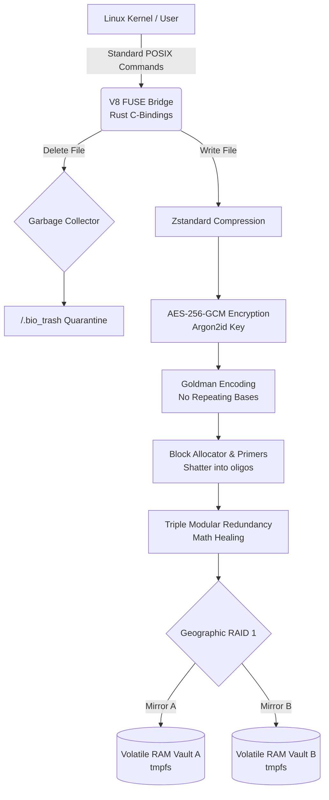

# 🚀 DNA-POSIX: V8 Enterprise Core
> A zero-trust, anti-forensic Virtual File System bridging the Linux kernel and synthetic biology for complete data sovereignty.

[](LICENSE)
[]()
[]()

---

## 📖 Overview
Traditional magnetic and solid-state drives leave permanent forensic trails and rely on conventional digital architectures. As we move into deep-tech infrastructure, synthetic biology (DNA) presents a high-density, chaos-resistant medium for data storage, but it completely lacks a native bridge to standard operating systems.

DNA-POSIX is a mathematically proven, self-healing, cryptographically locked Virtual File System (VFS). Engineered natively in pure Rust, the V8 Enterprise Core bypasses traditional hard drives entirely. It translates standard digital POSIX commands (`cp`, `rm`, `cat`) into printable, chaos-resistant biological chemistry, treating a simulated liquid pool of nucleotides (A, C, G, T) as a volatile, high-speed block storage device.

**The Core Mandate:** Absolute data sovereignty and zero-trust forensics through volatile RAM execution and mathematically proven biological encoding.

## ✨ Key Features
* **Anti-Forensic Volatile Execution (`tmpfs`):** The biological payload physically evaporates on power loss. The engine writes `.fasta` strands directly to a pure-RAM partition, destroying the forensic trail in milliseconds.
* **Zero-Trust Cryptography:** AES-256-GCM encryption with an Argon2id key forged entirely in volatile memory via a visually suppressed Master Mount Password.
* **Biological Codec (Goldman Encoding):** A context-aware state machine mathematically guarantees that identical chemical bases never sit next to each other, preventing real-world physical synthesizer failure.
* **Self-Healing TMR:** Triple Modular Redundancy (FEC) synthesizes bytes multiple times, mathematically outvoting cosmic radiation and chemical degradation to heal binaries in real-time.
* **Deep-Tech Storage Economics:** Zstandard (Zstd) compression intercepts the kernel write, achieving up to 98.6% compression before biological translation to save thousands in physical synthesis costs.

## 🛠️ Tech Stack
* **Language:** Pure Rust
* **Framework:** `libfuse` (Linux C-Bindings)
* **Environment:** Linux OS / WSL2 (Ubuntu)
* **Key Libraries/APIs:** `ratatui` (Matrix Dashboard UI), AES-256-GCM, Argon2id, Zstandard

## ⚙️ Architecture & Data Flow



* **Input:** Standard Linux POSIX commands (Write, Read, Delete) are intercepted natively from the OS by the FUSE kernel bridge.
* **Processing:** Digital data is aggressively compressed (Zstd), cryptographically locked (AES-256), translated into chemistry (Goldman Encoding), and shattered into redundant biological blocks with unique primer indices.
* **Output:** Chaos-resistant biological strings (`.fasta`) are geographically mirrored to Volatile RAM Vaults (RAID 1), instantly appearing to the OS as a seamless 1.0 Petabyte storage array.

## 🔒 Privacy & Data Sovereignty
* **Data Collection:** None. Absolute zero telemetry or hidden analytics. All data processing occurs strictly in local memory.
* **Permissions Required:** `sudo` privileges are required specifically to allocate the `tmpfs` hardware RAM sandboxes and mount the FUSE bridge directly to the kernel.
* **Cloud Connectivity:** Disabled and not required. The engine is offline-first and fully isolated.

## 🚀 Getting Started

### Prerequisites
* A Linux environment or Windows Subsystem for Linux (WSL2).
* `rustc` and `cargo` installed.
* `fuse` installed on your kernel (`sudo apt install fuse`).

### Installation

1. **Clone the repository:**
   ```bash
   git clone [https://github.com/TheSNMC/DNA-POSIX.git](https://github.com/TheSNMC/DNA-POSIX.git)
   cd DNA-POSIX
   ```

2. **Run the automated lab deployment script (dynamically scales RAM vaults and compiles the core):**
   ```bash
   ./launch_lab.sh
   ```

3. **Boot the Matrix Command Center:**
   Enter the Master Mount Password when prompted to forge the volatile key and mount the engine.

## 🤝 Contributing
Contributions, issues, and feature requests are welcome. Feel free to check the issues page if you want to contribute. (Currently seeking hardware engineers to build physical synthesizer APIs).

## 📄 License
See the LICENSE file for details.  
Built by an independent developer in Chennai, India.
